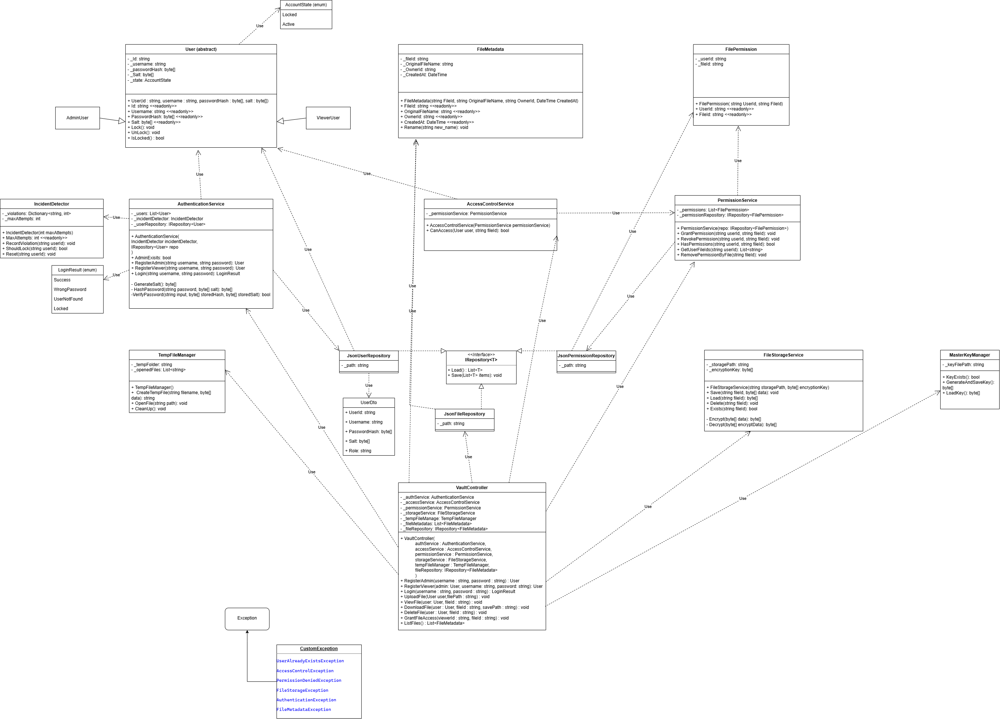
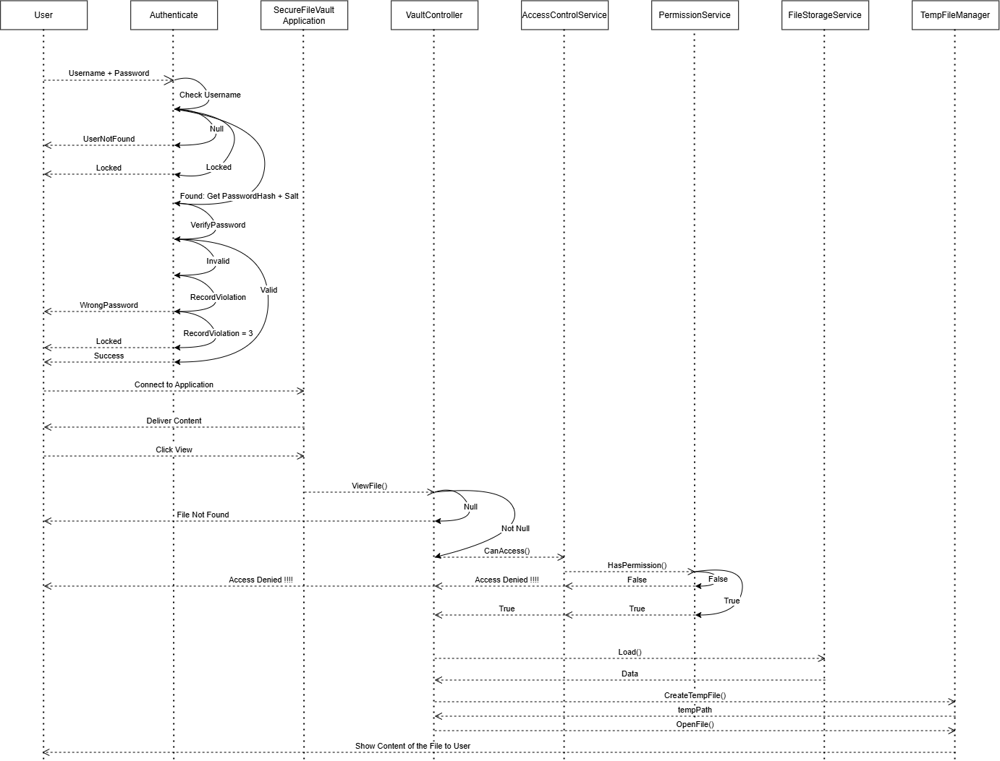
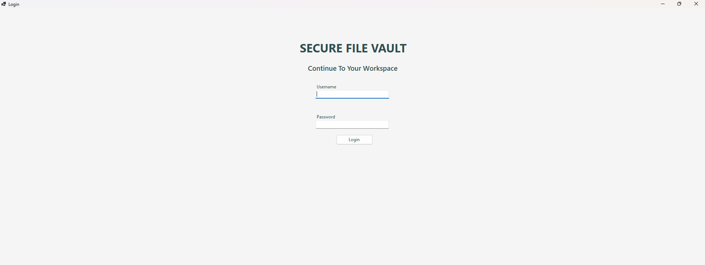
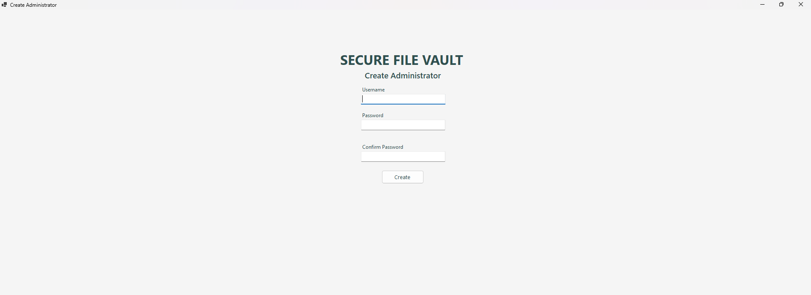
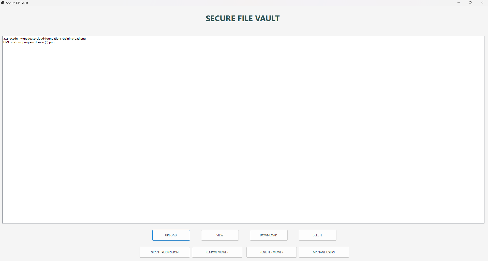
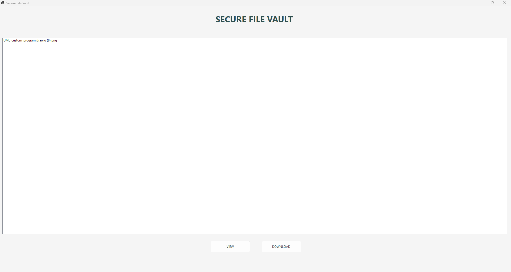

# Secure File Vault
A local desktop application developed in C# to securely store, manage, and share files with controlled user access.

The system is designed for personal use where important files are stored locally in encrypted form. It supports two roles: Administrator and Viewer. Administrator has full control over stored files, user permissions, and register new Viewer while Viewers can only access files that have been explicitly shared with them.

---

## Overview
Secure File Vault focuses on protecting sensitive files from unauthorized access through a combination of:

- File encryption
- Authentication
- Role-based access control (RBAC)
- Account protection
- Secure temporary file handling
- Persistent local storage

Files are encrypted before being stored and decrypted only when they are accessed through the application.

## Key Features
### Authentication & Account Protection
- Administrator account creation on first launch
- There is only one Administrator
- Username and password authentication
- Password hashing with unique salts
- Failed-login tracking
- Automatic account locking after repeated failed attempts
- Viewer account management

### File Management
- Upload files
- View files
- Download files
- Delete files
- File metadata management

### Access Control
- Administrator and Viewer roles
- Administrator has full access to the vault
- Viewer access is restricted to explicitly shared files
- Grant and revoke file permissions
- Unauthorized users are denied access to protected files

### Secure File Handling
- Files are encrypted before being stored
- Files are decrypted only when accessed
- Decrypted files are temporarily created for viewing
- Temporary files are tracked and cleaned up when the application closes
- Temporary storage is also cleaned on application startup to remove files left from previous sessions

## Architecture
The application follows a layered architecture consisting of:
- Domain - core entities such as User, FileMetadata, and FilePermission
- Services - authentication, access control, permissions, and related business logic
- Infrastructure - JSON repositories, encryption, key management, file storage and temporary file handling
- Application - VaultController and the Windows Forms user interface

The project applies several design patterns, including:
- Repository Pattern
- Dependency injection
- DTO Pattern
- Layered Architecture

### UML Class Diagram

### Sequence Diagram - View File Process
The diagram below illustrates how the application checks permissions, retrieves, and decrypts the file, creates a temporary file, and opens it for viewing.

## Security Design
### Encryption
Files are encrypted before being written to local storage. When a user requests to view or download a file, the application retrieves the encrypted data and decrypts it when required.

### Role-Based Access Control
The system separates users into two roles:
- Administrator:
    - Upload files
    - View files
    - Download files
    - Delete files
    - Register Viewers
    - Grant file permissions
    - Remove Viewers
    - Manage users
- Viewer:
    - View permitted files
    - Download permitted files

### Password Protection
Passwords are not stored directly. The application generates a unique salt for each account and stores the resulting password hash.

### Account Locking
Failed login attempts are tracked. When the configured threshold is exceeded, the account is locked to reduce the risk of repeated unauthorized login attempts.

## Screenshots
### Login

### Create Administrator

### Administrator Dashboard

### Viewer Dashboard

## Tech Stack
- C#
- .NET / Windows Forms
- JSON-based local persistence
- Object-Oriented Programming
- AES encryption
- Repository Pattern
- Dependency Injection
- DTO Pattern

## How to Run
### Run the Published Application
Download the latest release from the [Releases](../../releases) page.
1. Download and extract `SecureFileVault-v1.0.zip`.
2. Run `SecureFileVault.exe`.
3. On the first launch, create an Administrator account.
4. Log in and start using the vault.

The application automatically creates the required local directories (`data`, `storage`, and `temp`) when needed.

### Run from Source
1. Clone this repository.
2. Open `SecureFileVault.slnx` in Visual Studio.
3. Build and run the project.

## Future Improvements
Potential improvements include:
- More advanced UI design
- Additional file-preview support
- Improved temporary-file lifecycle management
- Additional security controls for local storage
- Extended testing and validation

## Author
**Pham Tien Dat**

Bachelor of Cyber Security, Swinburne University of Technology

[GitHub](https://github.com/tiendat6756) · [LinkedIn](https://www.linkedin.com/in/tien-dat-90669036a/)